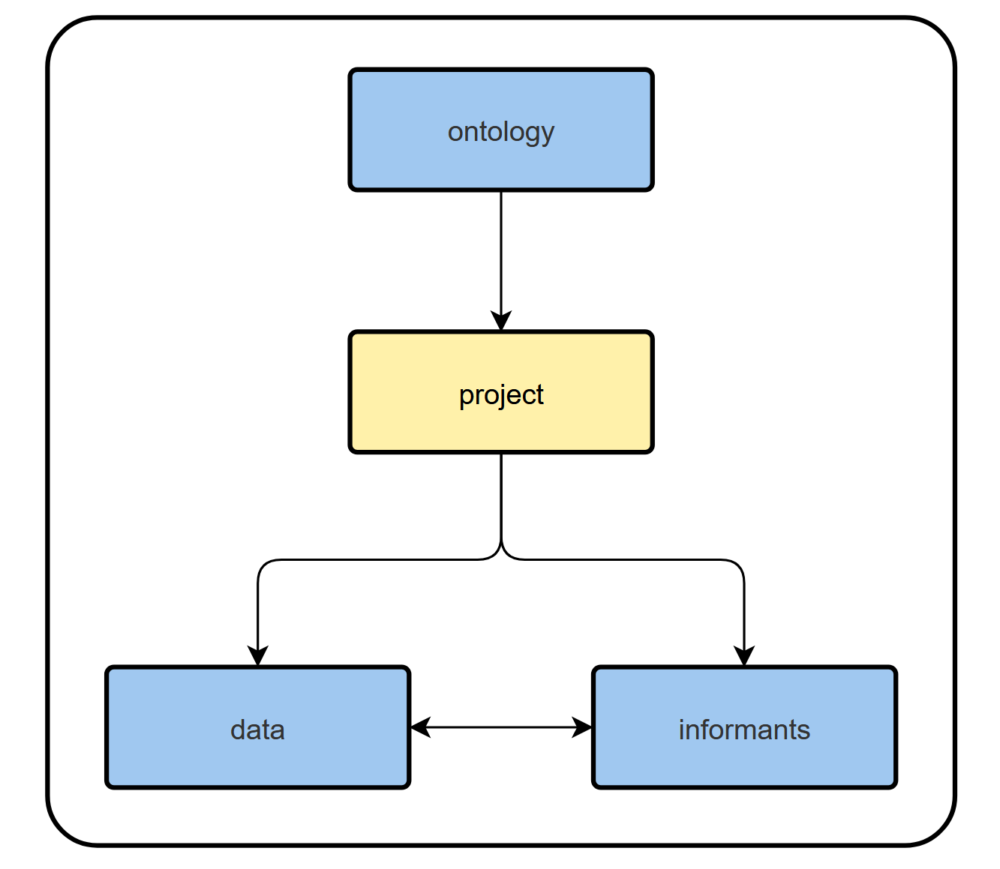
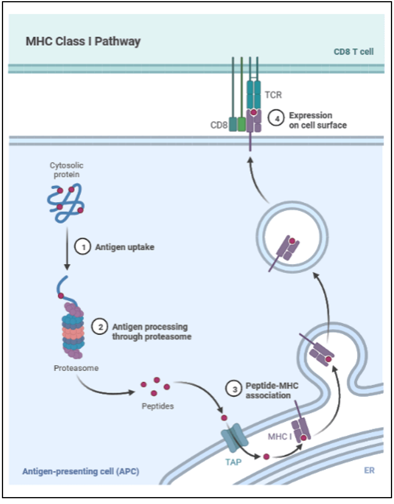
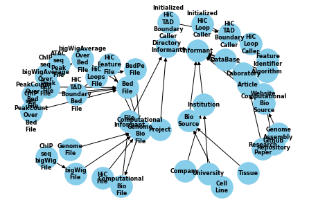

# ont_rdb
``ont_rdb`` (ontological relational database) is a simple Python package for constructing relational databases that are integrated with ontological context.

<figure>
    
</figure>

## Introduction
An ontology is a formal representation of knowledge within a domain that enables improved comprehension, navigation, and processing of that domain's diverse objects. ``ont_rdb`` facilitates the building, sharing, modifying, and extending of arbitrary ontologies by the writing of "ontology scripts.'' An ontology script in this context is simply a Python scripts that satisfies the following properties:

1. The script name is of the form ``{X}_ontology.py``.
2. The script imports the ``informant_class.py`` module, which defines the **informant** class.
3. The script defines classes that ultimately inherit from classes defined in ``informant_class.py``.

The ontology defined by an ontology script may be represented with an acyclic, directed graph, where the informant class is the unique source node. The informant class is designed to represent a generic schema, such as is used in SQL, as a Python object. 
<figure>
    
</figure>

``ont_rdb`` is envisioned as operating in parallel with Snakemake and possibly a larger database structure like SQL.

## Motivation

The integration of a relational database structure with that of a rooted ontology is motivated by the desire to **keep large data analysis projects organized**, especially when multiple steps that produce, process and combine new files of various different types are involved. By associating informants to the objects relevant to a processing pipeline, one facilitates the identification and organizion of objects and their attributes. One can consider an informant as an interpretable wrapper around a datum, which provides relevant information about the datum. 

Since informants are simply Python objects, they can easily encapsulate and compartmentalize methods relevant to data processing operations, and can be used to "expose" or "express" only relevant information from external scripts. The concept of an informant is even partially motivated by principles in immunology: Just like cells of an organism express self-peptides to immune surveillance as recognition signals, informants express information about a datum to a user or process that enables correct handling of the datum. Informants are intended to offer a highly general, organized, and flexible apparatus of interpretable communication between objects and users that can simplify the organization of data processing operations.
<figure>
    
    <figcaption>https://microbenotes.com/mhc-antigen-processing-presentation/#major-histocompatibility-class-ii-mhc-class-ii
    </figcaption>
</figure>

## Features

Within the ``ont_rdb`` package directory, the folder labeled ``ontologies`` stores an example ontology script written for projects that process Hi-C data. Other scripts can be written and loaded into the folder. It is recommended to introduce new fields/attributes/methods of informant sub-classes along with **meta-data** that describes those new fields/attributes/methods in an interpretable way.

``ont_rdb`` constructs a dataframe representing an ontology's directed, rooted, acyclic graph (DRAG), and facilitates constructing generic examples from the ontology by populating terminal nodes in the graph (specific objects) and applying forgetful functors to map those specific objects onto corresponding examples of the more general objects they inherit from. The function ``convert_to_informant_class`` serves as this forgetful functor, with parameters that can adjust the manner in which one class is projected into another (ex: ``clip``, ``push``).

The ``ont_rdb_explorer.ipynb`` script can be used to interact with the ontology defined by any chosen script in the folder. The script may be selected from a drop-down menu and imported. An **informant dataframe** representing the associated directed graph can be constructed by following the simple directions in the Jupyter notebook.

Informant dataframes leverage existing pandas query operations and the Informant class to simulate a queryable relational database based on the attributes of stored informant objects.

To construct informant dataframes, one may use the auxiliary functions in ``informant_class.py`` to leverage existing directory structures to define and store informant objects associated to files within that directory structure. In particular, the function ``create_file_informant_list_from_folder`` facilitates this operation.

## Installation
Simply run

``pip install git+https://github.com/cfrankston728/ont_rdb.git``

or clone the repository from github.

## Requirements

The dependencies of ``ont_rdb`` can be found listed within the following file:

``./ont_rdb/ont_rdb/workflow/snakemake_rules/envs/environment.yaml``

## Configuration

Using ``ont_rdb`` requires snakemake and the specification of a snakemake profile. Using ``mamba`` as the ``conda-frontend`` is recommended.

## Contributing

Thank you for your interest in contributing to our project! As this is a private repository, we assume you're already familiar with its goals and have been invited to contribute. Here are some guidelines to help you get started:

### Reporting Issues

- **Bug Reports:** If you encounter a bug, please file an issue using our bug report template. Include as much detail as possible: what you were doing when the bug occurred, steps to reproduce the issue, expected vs. actual behavior, and any error messages.
- **Feature Requests:** We welcome ideas for new features. Please submit a feature request issue, describing the feature and why you think it would be a valuable addition.

### Making Contributions

- **Pull Requests:** Before starting work on a significant change, please open an issue to discuss your ideas. This will allow us to give you feedback and help ensure that your time is well spent.
  - Fork the repository (if external access is granted).
  - Create a new branch for your changes.
  - Make your changes and commit them with clear, concise commit messages.
  - Push your branch and submit a pull request to the main branch.
  - Include a description of your changes and the issue number(s) your pull request addresses.
- **Code Review:** All contributions will be reviewed for quality and compatibility with the project goals. We aim to review pull requests promptly, but response times may vary based on current priorities.

### Coding Standards

- Please follow the coding standards and style guidelines for the project. This ensures consistency and maintainability of the codebase.
- Include comments in your code where necessary to explain complex or non-obvious logic.

### Legal

- By contributing to this project, you agree that your contributions will be licensed under its MIT License.
- Ensure that you have the right to use and contribute any code or content you submit.

For more information, feel free to contact the project maintainers.

## License

cfrankston728/ont_rdb is licensed under the

### MIT License

A short and simple permissive license with conditions only requiring preservation of copyright and license notices. Licensed works, modifications, and larger works may be distributed under different terms and without source code.

## Authors
Connor Frankston, Yardımcı Lab, OHSU

## Acknowledgments
I would like to offer a special thanks to Theresa Lubardi, Kenny Pavan, Ben Skubi, and Sam Kupp for their encouragement, support, and engagement with my vision for this project. I would also like to thank Gürkan Yardımcı, Sadik Esener, Matthew Rames, Tuğba and Furkan Özmen, Jungsun Kim, Juyoung Lee, Christopher Eddy, and Yujia Zhang for their knowledge, direction and mentorship.