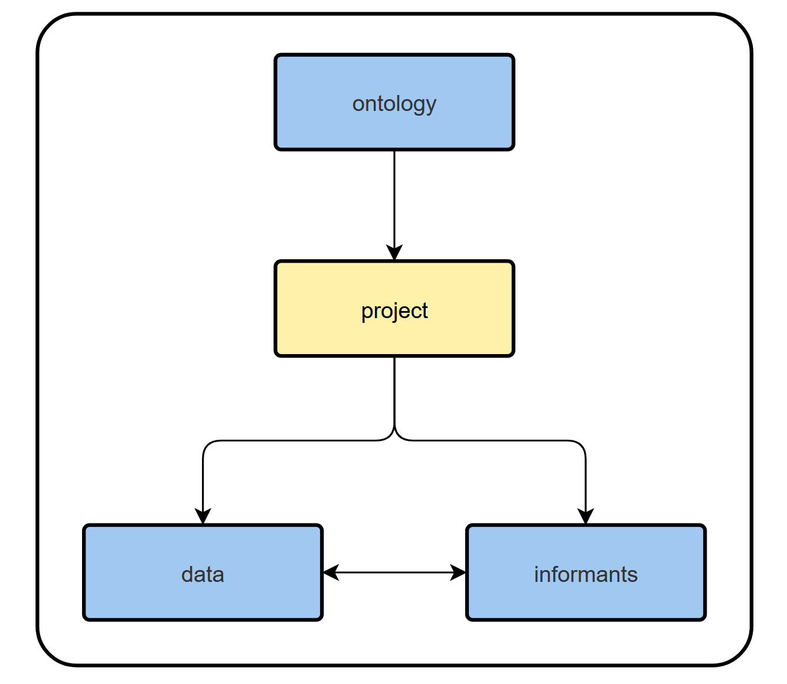
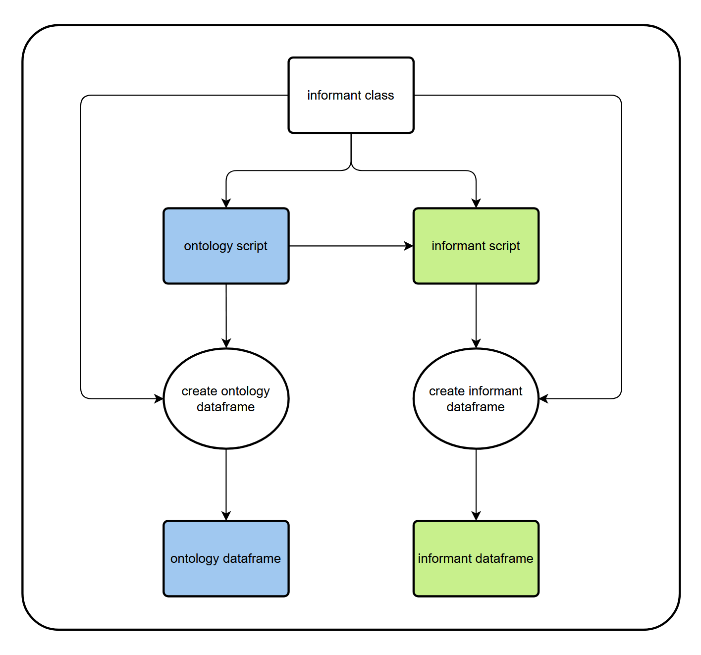
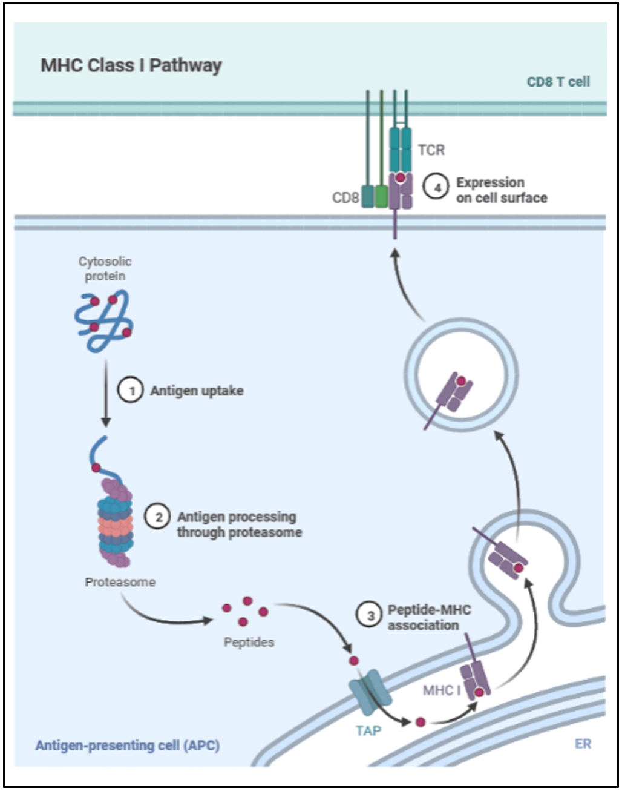

# ont_rdb

`ont_rdb` is a Python package for representing project data objects through ontology-linked informants and dataframe-backed relational structures.

It is intended for research projects where many scripts, files, intermediate outputs, metadata records, and analysis objects need to remain interpretable and queryable across time.

<figure>
    
</figure>

## Overview

`ont_rdb` uses Python classes to define project-specific ontologies. An ontology script defines a directed acyclic inheritance graph rooted in the base `Informant` class. Instances of these classes can then be stored, queried, transformed, and exported through informant dataframes.

The package has two central ideas:

1. An **ontology script** defines the available object types in a project.
2. An **informant dataframe** stores instances of those object types in a queryable dataframe structure.

This makes project state easier to inspect than loose paths, ad hoc dictionaries, or undocumented output folders.

## Ontology scripts

An ontology script is a Python file that defines informant subclasses for a domain.

A typical ontology script satisfies the following conventions:

1. The script name is of the form `{name}_ontology.py`.
2. The script imports classes from `informant_class.py`.
3. The script defines classes that inherit, directly or indirectly, from `Informant`.

For example:

```python
from informant_class import File_Informant

class HiC_File(File_Informant):
    pass
```

The resulting ontology can be converted into an ontology dataframe. This dataframe records class names, class objects, parent-child relationships, source depth, sink depth, and terminal-node status.

<figure>
    
</figure>

## Informants

An informant is a Python object that represents a project-relevant entity, such as:

```text
file
directory
dataset
algorithm
parameter set
project
genome assembly
cell line
analysis output
```

Informants can store metadata, paths, methods, and relationships to other informants. The goal is to make project objects inspectable and queryable without scattering metadata across disconnected scripts.

The name is inspired by immunology: informants expose selected information about a larger underlying object, similar to how antigen presentation exposes interpretable fragments of cellular state.

<figure>
    
    <figcaption>https://microbenotes.com/mhc-antigen-processing-presentation/#major-histocompatibility-class-ii-mhc-class-ii</figcaption>
</figure>

## Ontology dataframes

An ontology dataframe can be built directly from an ontology script.

From the package directory:

```bash
python create_ontology_dataframe.py \
  --inf informant_class.py \
  --ont ontologies/hic_January_24_2024_ontology.py \
  --o ontology_dataframes/hic_January_24_2024_ontology_dataframe.pkl
```

The output is a pickle file containing a dataframe representation of the ontology graph.

The dataframe includes columns such as:

```text
informant_subclass_name
informant_subclass
direct_parent_indices
direct_child_indices
is_sink
source_depth
sink_depth
to_nearest_sink
```

Because the dataframe stores Python class objects, loading the pickle requires the package directory and ontology directory to be importable. For example:

```python
import sys
import pandas as pd

sys.path.insert(0, "/path/to/ont_rdb/ont_rdb")
sys.path.insert(0, "/path/to/ont_rdb/ont_rdb/ontologies")

df = pd.read_pickle("ontology_dataframes/hic_January_24_2024_ontology_dataframe.pkl")
```

## Informant dataframes

Informant dataframes store informant objects and expose dataframe-style query operations over their attributes.

For example, a query may refer to informant attributes or to the informant object itself using `@`:

```python
"(@name == 'my_informant') | (isinstance(@self, File_Informant))"
```

With `isinstance` supplied as additional context, this query returns informants whose `name` is `my_informant` or whose object is an instance of `File_Informant`.

Informant dataframes are useful for:

```text
tracking generated files
recovering project metadata
querying outputs by object type
moving or renaming path-linked project objects
recording algorithm outputs
connecting project logs to stored artifacts
```

## Directory-derived informants

The package includes helpers for constructing informants from existing directory structures.

In particular, `create_file_informant_list_from_folder` can be used to traverse a folder and generate informants for files found within it.

This is useful when a project already has meaningful filesystem organization and that structure needs to be represented in dataframe form.

## Explorer notebook

`ont_rdb_explorer.ipynb` provides an interactive way to inspect ontology scripts, build ontology dataframes, and explore informant dataframe behavior.

The notebook should call `create_ontology_dataframe.py` directly. Snakemake is not required for ontology dataframe construction.

## Installation

Install from GitHub:

```bash
pip install git+https://github.com/cfrankston728/ont_rdb.git
```

Or clone the repository:

```bash
git clone git@github.com:cfrankston728/ont_rdb.git
cd ont_rdb
```

For editable development:

```bash
pip install -e .
```

## Requirements

The core package uses standard Python scientific/data tooling, including:

```text
python
pandas
click
```

Additional project-specific workflows may require other libraries depending on the ontology scripts and informant subclasses being used.

Snakemake is not required for core ontology dataframe construction.

## Repository organization

Typical source layout:

```text
ont_rdb/
  informant_class.py
  create_ontology_dataframe.py
  create_informant_dataframe.py
  explorer_auxiliaries.py
  launch_project_3.0.py
  ont_rdb_explorer.ipynb
  configs/
  ontologies/
  data/
  ontology_dataframes/
```

Important source files:

```text
informant_class.py
  Defines the base informant classes and dataframe utilities.

create_ontology_dataframe.py
  Builds ontology dataframes directly from ontology scripts.

explorer_auxiliaries.py
  Provides helper functions used by explorer notebooks and project workflows.

launch_project_3.0.py
  Supports project initialization and explorer setup.

ontologies/
  Stores ontology scripts.

ontology_dataframes/
  Stores generated ontology dataframe pickles.
```

Generated/runtime artifacts should generally not be committed:

```text
.snakemake/
__pycache__/
.ipynb_checkpoints/
*.pyc
*.swp
ontology_dataframes/*.pkl
```

## Snakemake status

Earlier versions used Snakemake to wrap ontology dataframe construction. That layer is no longer required for the core package.

The direct command:

```bash
python create_ontology_dataframe.py \
  --inf informant_class.py \
  --ont ontologies/{name}_ontology.py \
  --o ontology_dataframes/{name}_ontology_dataframe.pkl
```

replaces the previous Snakemake target construction path.

Historical Snakemake workflow files may be archived, but they should not be treated as active package infrastructure unless a future multi-step workflow requires them.

## Development notes

Keep functional source changes separate from generated artifact changes.

Recommended commit separation:

```text
1. package behavior changes
2. notebook or explorer changes
3. repository hygiene changes
4. generated artifact updates, only if intentionally versioned
```

Avoid committing notebook checkpoints, runtime caches, generated graph HTML, generated pickle files, or ad hoc backup scripts.

## Contributing

This is primarily a research infrastructure package. Contributions should preserve interpretability, explicit metadata, and compatibility with existing ontology scripts when possible.

When making changes:

```text
use explicit paths and metadata
avoid hidden workflow state
avoid unnecessary external orchestration
keep generated artifacts out of source commits unless deliberately versioned
document interface changes
test ontology dataframe construction on at least one existing ontology script
```

Before committing changes to ontology construction, test:

```bash
python create_ontology_dataframe.py \
  --inf informant_class.py \
  --ont ontologies/hic_January_24_2024_ontology.py \
  --o /tmp/hic_January_24_2024_ontology_dataframe.pkl
```

Then verify loading:

```python
import sys
import pandas as pd

sys.path.insert(0, "/path/to/ont_rdb/ont_rdb")
sys.path.insert(0, "/path/to/ont_rdb/ont_rdb/ontologies")

df = pd.read_pickle("/tmp/hic_January_24_2024_ontology_dataframe.pkl")
print(df.shape)
```

## License

`ont_rdb` is licensed under the MIT License.

## Authors

Connor Frankston, Yardimci Lab, OHSU

## Acknowledgments

Special thanks to Theresa Lusardi, Kenny Pavan, Ben Skubi, and Sam Kupp for encouragement, support, and engagement with the vision for this project.

Thanks also to Gurkan Yardimci, Sadik Esener, Matthew Rames, Tugba and Furkan Ozmen, Jungsun Kim, Juyoung Lee, Christopher Eddy, and Yujia Zhang for knowledge, direction, and mentorship.
